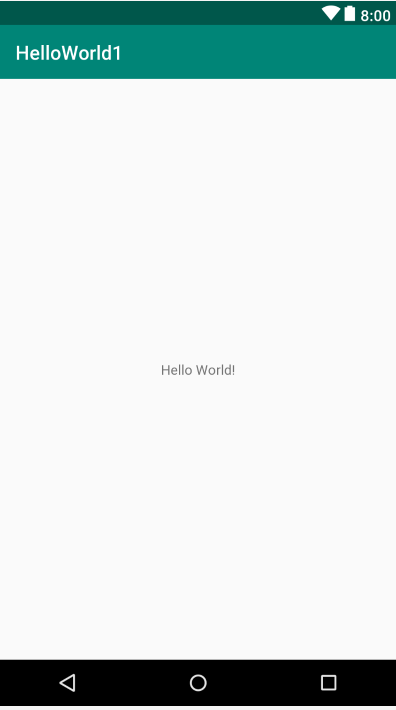
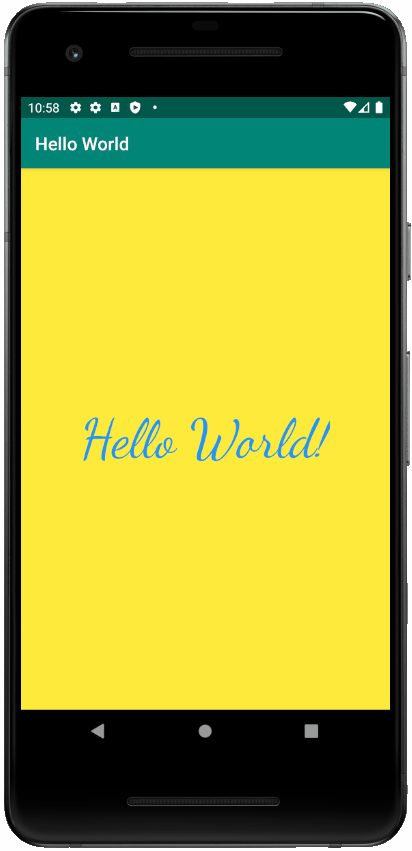

# Android Weekly Series

Welcome to the Android Weekly Series!
Here we will cover all the essential skills needed to build professional, robust, and attractive Android apps.

## 1. Hello World App

There's a higher omnipotent deity that tells us to start each new CS language we learn with a "Hello World" app.
The last time someone disobeyed this deity, their apartment was found vacant and there was no trace of that person.

For the sake of our safety, we will do what this deity wants.
Hence, our first app with be the, yup you guessed it — "Hello World" app.

### Screenshots

#### Starter Code

 
 

#### Goal

### Skills Learned

1. Basics of Android layouts
2. Basics of Android Studio
